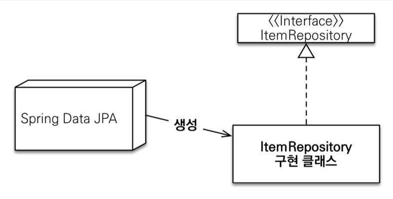
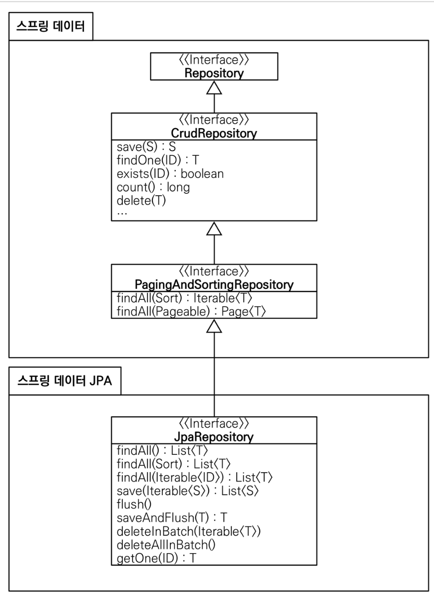

# 4. 공통 인터페이스 기능

## 순수 JPA 기반 리포지토리 만들기

### 기본적인 CRUD

```java
@Repository
public class MemberJpaRepository {
    @PersistenceContext
    private EntityManager em;
    public Member save(Member member) {
        em.persist(member);
        return member;
    }
    public void delete(Member member) {
        em.remove(member);
    }
    public List<Member> findAll() {
        return em.createQuery("select m from Member m", Member.class)
                .getResultList();
    }
    public Optional<Member> findById(Long id) {
        Member member = em.find(Member.class, id);
        return Optional.ofNullable(member);
    }
    public long count() {
        return em.createQuery("select count(m) from Member m", Long.class)
                .getSingleResult();
    }
    public Member find(Long id) {
        return em.find(Member.class, id);
    } 
}

```
**너무 기본적인거라 정리는 생략**

```java
@Repository
  public class TeamJpaRepository {
      @PersistenceContext
      private EntityManager em;
      public Team save(Team team) {
          em.persist(team);
          return team;
      }
    public void delete(Team team) {
        em.remove(team);
    }
    public List<Team> findAll() {
        return em.createQuery("select t from Team t”, Team.class)
                .getResultList();
    }
    public Optional<Team> findById(Long id) {
        Team team = em.find(Team.class, id);
        return Optional.ofNullable(team);
    }
    public long count() {
        return em.createQuery("select count(t) from Team t”, Long.class)
                .getSingleResult();
    } 
}
```

이렇게 Member, Team에 대해서 기본적인 CURD 가 완성이 되었다 update는 변경감지가 있기 때문에 em으로 조회하고 em을 수정하고 트랜잭션 커밋하면 DB 업데이트를
날린다 이런것들을 보면 어쩌피 CRUD는 비슷비슷한데 반복작업을 하는 느낌이 든다 어떤 천재 개발자가 이런 문제를 깔끔하게 인터페이스로 해결한다 그 오픈소스가 나중에
spring JPA 로 발전하게 된다 spring data JPA 가 이 문제들을 어떻게 해결했는지 알아보자

## 공통 인터페이스 설정
먼저 javaConfig 설정을 해줘야 한다 하지만 스프링 부트 사용시 생략이 가능하다 -> 설정할 필요가 없다 부트가 알아서 다 해준다!
@SpringBootApplication 여기 패키지부터 패키지 하위는 자동으로 Spring Boot JPA 가 자동으로 끌어올 수 있다 
```java
  public interface MemberRepository extends JpaRepository<Member, Long> {
  }
```
얘를 잘 보면 인터페이스고 구현체가 없다 실제로 출력해보면 memberRepository.getClass() class com.sun.proxy.$ProxyXXX 이런식이다 이게 뭐냐면
스프링이 인터페이스를 보고 JPA 가 구현 클래스를 지가 만들어서 주입했다



스프링 데이터 JPA 가 어플리케이션 로딩 시점에 인터페이스인 ItemRepository 를 가지고 있으면 구현 클래스를 만들어준다 개발자가 만들지 않아도 된다
실제로 출력했을때 프록시가 나온 이유는 JPA 가 java 의 기본적인 프록시 기술로 가짜 클래스를 만들고 주입해준 것이다 @Repository 어노테이션을 생략 가능하다
**결론은 우리가 인터페이스만 잡으면 JPA 가 구현클래스를 프록시로 만들어서 주입해준다**

## 공통 인터페이스 적용

```java
@SpringBootTest
@Transactional
public class MemberRepositoryTest {
    @Autowired
    MemberRepository memberRepository;

    @Test
    public void testMember() {
        Member member = new Member("memberA");
        Member savedMember = memberRepository.save(member);
        Member findMember =
                memberRepository.findById(savedMember.getId()).get();
        Assertions.assertThat(findMember.getId()).isEqualTo(member.getId());
        Assertions.assertThat(findMember.getUsername()).isEqualTo(member.getUsername())
        ;
        보장
        Assertions.assertThat(findMember).isEqualTo(member); //JPA 엔티티 동일성 }
    }

    @Test
    public void basicCRUD () {
        Member member1 = new Member("member1");
        Member member2 = new Member("member2");
        memberRepository.save(member1);

        memberRepository.save(member2);
//단건 조회 검증
        Member findMember1 = memberRepository.findById(member1.getId()).get();
        Member findMember2 = memberRepository.findById(member2.getId()).get();
        assertThat(findMember1).isEqualTo(member1);
        assertThat(findMember2).isEqualTo(member2);
//리스트 조회 검증
        List<Member> all = memberRepository.findAll();
        assertThat(all.size()).isEqualTo(2);
//카운트 검증
        long count = memberRepository.count();
        assertThat(count).isEqualTo(2);
//삭제 검증 memberRepository.delete(member1); memberRepository.delete(member2);
        long deletedCount = memberRepository.count();
        assertThat(deletedCount).isEqualTo(0);
    }
}
```

전부 잘 돌아간다....

## 공통 인터페이스 분석
커맨드 찍어보면 여러가지의 기능들이 있다  
```java
public interface JpaRepository<T, ID extends Serializable> extends PagingAndSortingRepository<T, ID>
{
    
}
```
PagingAndSortingRepository 은 패이징하고 정렬하는건데 noSQL이든 RDB 전부 다 비슷하기 때문에 공통 인터페이스가 적용된다는 것이다 얘는 spring-data.commons
이다 공통이기 때문에 JpaRepository 는 spring.data-jpa 이다 얘는 jpa 에만 쓰는 CrudRepository 는 말그대로 기본적은 CRUD 기능이 들어있다 마지막
최상위에는 Repository 가 있는데 얘는 기능이 있는건 아니고 스프링 빈을 만들때 클래스패스 스캐닝을 쉽게 해주는 것이다


이 사진을 보면 스프링 데이터 부분은 spring.data.commons 부분이다 그리고 그밑에 부분은 JPA 에 특화된 기능들만 제공하는 spring.data-jpa 이다 위에 공통
기능은 몽고디비로 바꾸더라도 기본적인 기능들은 유사하게 제공된다 하지만 디비를 바꾸는일을 거의 없다 -> 유사한 인터페이스로 편하게 개발할 수 있다 
- T findOne(ID) Optional<T> findById(ID) 변경
- boolean exists(ID) boolean existsById(ID) 변경

제네릭 타입
- T : 엔티티
- ID : 엔티티의 식별자 타입 S : 엔티티와 그 자식 타입

주요 메서드
- save(S) : 새로운 엔티티는 저장하고 이미 있는 엔티티는 병합한다.
- delete(T) : 엔티티 하나를 삭제한다. 내부에서 EntityManager.remove() 호출
- findById(ID) : 엔티티 하나를 조회한다. 내부에서 EntityManager.find() 호출
- getOne(ID) : 엔티티를 프록시로 조회한다. 내부에서 EntityManager.getReference() 호출 -> 진짜 엔티티를 가져오는게 아니라 가짜 프록시를 가져오고
프록시를 실제 내가 원할때 값에 접근해서 값을 꺼낼때 실제 디비에 쿼리가 날라가서 프록시를 초기화 한다
- findAll(...) : 모든 엔티티를 조회한다. 정렬( Sort )이나 페이징( Pageable ) 조건을 파라미터로 제공할 수 있다.

> 참고: JpaRepository 는 대부분의 공통 메서드를 제공한다.
> 문제: 만약에 공통 기능이 아니라 유저의 이름으로 멤버를 찾고싶으면 이건 도메인 특화 기능이라 공통으로 만드는게 불가능하다
> 해결: 쿼리메소드 기능으로 해결
