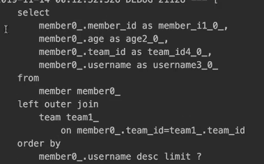
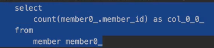
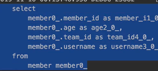
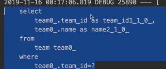
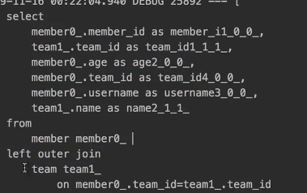
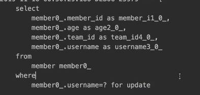

# 쿼리 메소드 기능

도메인에 특화된 조회의 해결 방법이다 그래서 JPA는 쿼리 메소드를 제공한다 3가지 방법이 있다

## 1. 메소드 이름으로 쿼리 생성
- 메소드 이름을 분석해서 JPQL 쿼리 실행

### 이름과 나이를 기준으로 회원을 조회하려면
```java
public List<Member> findByUsernameAndAgeGreaterThan(String username, int age) {
      return em.createQuery("select m from Member m where m.username = :username
  and m.age > :age")
              .setParameter("username", username)
              .setParameter("age", age)
              .getResultList();
}
```
이렇게 해야 한다

하지만 JPA를 사용하면
```java
public interface MemberRepository extends JpaRepository<Member, Long> {
    List<Member> findByUsernameAndAgeGreaterThan(String username, int age);
}
```

이렇게 간단하게 구현할 수 있다 해석해보면 Username은 equal로 적용되고 AgeGreaterThan은 age(파라미터 조건)보다 크면 이라는 뜻이다 이게 바로 JPA가 제공
하는 강력한 기능 중 하나인 메소드 이름으로 쿼리를 만들어준다 만약에 메소드명이 잘못되면 에러가 난다 에러 메세지는 많이 겪어봤지만 친절하다
https://docs.spring.io/spring-data/jpa/docs/current/reference/html/#jpa.query-methods.query-creation -> 공식 문서
왠만하면 다 된다 하지만 전부 다 되는건 아니다 그리고 제일 심각한 문제는 메소드명이 너무 길어질 수 있다 영한님은 조건이 2개 넘어가면 이 방법을 안쓴다 하신다

By뒤에는 where 절에 해당하는 파라미터들을 적어주면 된다 By뒤에 아무것도 없으면 전체 다 긁어온다

- 조회: find...By, read...By, query...By, get...By
- COUNT: count...By 반환타입: long
- EXIST: exist...By 반환타입: boolean
- 삭제: delete...By, remove...By 반환타입: long
- DISTINCT: findDistinct, findMemberDistinctBy
- LIMIT: findFirst3, findFirst, findTop, findTop3 -> 3은 위에서 3개 라는 뜻이다

복잡하지 않은 짤막짤막한 쿼리를 사용할때 유용하게 사용한다


> 참고: 이 기능은 엔티티의 필드명이 변경되면 인터페이스에 정의한 메서드 이름도 꼭 함께 변경해야 한다. 그렇지 않으면 애플리케이션을 시작하는 시점에 오류가 발생한다.
> 이렇게 애플리케이션 로딩 시점에 오류를 인지할 수 있는 것이 스프링 데이터 JPA의 매우 큰 장점이다.

## 2. JPA NamedQuery
쿼리에 이름을 부여하고 호출하는 기능인데 이 기능은 실무에서 사용할 일이 없다

```java
@Entity
    @NamedQuery(
            name="Member.findByUsername",
            query="select m from Member m where m.username = :username")
public class Member {
}
```
이렇게 엔티티에 선언하고 
```java
public class MemberRepository {
      public List<Member> findByUsername(String username) {
          List<Member> resultList =
              em.createNamedQuery("Member.findByUsername", Member.class)
                  .setParameter("username", username)
                  .getResultList();
      } 
}
```
이렇게 사용할 수 있다

```java
@Query(name = "Member.findByUsername")
  List<Member> findByUsername(@Param("username") String username);
```

또한 이렇게 JPA 인터페이스에서 사용할 수 있다

```java
public interface MemberRepository
extends JpaRepository<Member, Long> { //** 여기 선언한 Member 도메인 클래스
      List<Member> findByUsername(@Param("username") String username);
}
```
이렇게 @Query 생략하고 메소드 이름만으로 Named 쿼리를 호출할 수 있다

- 스프링 데이터 JPA는 선언한 "도메인 클래스 + .(점) + 메서드 이름"으로 Named 쿼리를 찾아서 실행
- 만약 실행할 Named 쿼리가 없으면 메서드 이름으로 쿼리 생성 전략을 사용한다. 
- 필요하면 전략을 변경할 수 있지만 권장하지 않는다.
- @Query, 리포지토리 메소드에 쿼리 정의하는 기능이 너무 좋아서 굳이 잘 안쓴다

> 참고: 스프링 데이터 JPA를 사용하면 실무에서 Named Query를 직접 등록해서 사용하는 일은 드물다. 대신 @Query 를 사용해서 리파지토리 메소드에 쿼리를 직접 정의한다.

## 3. @Query, 리포지토리 메소드에 쿼리 정의하기
이 기능을 실무에서 많이 사용한다
```java
public interface MemberRepository extends JpaRepository<Member, Long> {
    @Query("select m from Member m where m.username= :username and m.age = :age")
    List<Member> findUser(@Param("username") String username, @Param("age") int
    age);
}
```
이렇게 쿼리를 바로 칠 수 있다 이 기능의 장점은 쿼리에 오타가 생기면 어플리케이션 로딩 시점에 쿼리를 파싱해서 오류가 빌셍힌다

## 4. @Query, 값, DTO 조회하기

지금까지는 엔티티 타입만 조회했다 

```java
@Query("select m.username from Member m")
    List<String> findUsernameList();
```
사용자 이름 리스트만 다 가져오고 싶으면 이렇게 하면 된다
id, username, team의 이름을 가져오고 싶으면 DTO로 조회하면 된다

```java
 @Data
  public class MemberDto {
      private Long id;
      private String username;
      private String teamName;
      public MemberDto(Long id, String username, String teamName) {
          this.id = id;
          this.username = username;
          this.teamName = teamName;
      }
}
```

```java
@Query("select new study.datajpa.dto.MemberDto(m.id, m.username, t.name) " +
          "from Member m join m.team t")
  List<MemberDto> findMemberDto();
```
이렇게 패키지명을 전부 적어줘야 한다 생성자에 매칭을 해준다 이렇게하면 DTO로 반환할 수 있다

## 5. 파라미터 바인딩
- 위치기반
- 이름기반

```java
select m from Member m where m.username = ?0 //위치 기반
select m from Member m where m.username = :name //이름 기반
```
가급적이면 이름기반을쓰고 위치기반은 잘 쓰지 않는다
> 참고: 코드 가독성과 유지보수를 위해 이름 기반 파라미터 바인딩을 사용하자 (위치기반은 순서 실수가 바꾸면...)

```java
@Query("select m from Member m where m.username in :names")
    List<Member> findByNames(@Param("names") Collection<String> names); //Collection 대신 List가능 하지만 상위의 Collection을 적어야 다른 애들도 받을 수 있다
```
컬렉션 파라미어 바인딩도 있다 in절로 여러개를 조회하고 싶을 때 사용한다
```java
List<Member> result = memberRepository.findByNames(Arrays.asList("AAA", "BBB"))
```
사용은 이렇게 하면 된다 은근 자주 사용된다

## 6. 반환 타입

스프링 데이터 JPA는 유연한 반환 타입을 지원 한다
```java
List<Member> findListByUsername(String name); //컬렉션
Member findByUsername(String name); //단건
Optional<Member> findOptionalByUsername(String name); //단건 Optional
```

이렇게 반환타입을 유연하게 쓸 수 있다

### 만약 조회 결과가 많거나 없으면?
- 컬렉션
  - 결과 없음: 빈 컬렉션 반환
- 단건 조회
  - 결과 없음: null 반환
  - 결과가 2건 이상: javax.persistence.NonUniqueResultException 예외 발생

> 참고: 단건으로 지정한 메서드를 호출하면 스프링 데이터 JPA는 내부에서 JPQL의 Query.getSingleResult() 메서드를 호출한다.
> 이 메서드를 호출했을 때 조회 결과가 없으면 javax.persistence.NoResultException 예외가 발생하는데 개발자 입장에서 다루기가 상당히 불편하다.
> 스프링 데이터 JPA는 단건을 조회할 때 이 예외가 발생하면 예외를 무시하고 대신에 null 을 반환한다.

## 7. 순수 JPA 페이징과 정렬

디비에 데이터가 100만건 있으면 전부 끌어올 수 없고 적당한 사이즈로 끊어서 데이터를 끌어와야된다

다음 조건으로 페이징과 정렬을 사용하는 예제 코드를 보자.

- 검색조건: 나이가 10살
- 정렬조건: 이름으로 내림차순
- 페이징 조건: 첫번째 페이지, 페이지당 보여줄 데이터는 3건

```java

    public List<Member> findByPage(int age, int offset, int limit){
            return em.createQuery("select m from Member m where m.age = :age order by m.username desc")
            .setParameter("age",age)
            .setFirstResult(offset)
            .setMaxResults(limit)
            .getResultList();
            }
            
    public long totalCount(int age){
            return em.createQuery("select count(m) from Member m where m.age = :age",Long.class)
                .setParameter("age",age)
                .getSingleResult();
            }
```

setFirstResult는 어디서부터 가져올건지 그거를 offset으로 넘기면 되고 setMaxResult는 개수를 몇개를 가져올건지 limit넣어 주면 페이징 처리가 끝난다
그리고 보통 페이징 쿼리를 짜면 지금 페이지가 몇번째 페이지인지 알기위해 totalCount라는 전체 개수를 반환하는 쿼리를 짜줘야 된다

```java

  @Test
  public void paging() throws Exception {
    //given
      memberJpaRepository.save(new Member("member1", 10));
      memberJpaRepository.save(new Member("member2", 10));
      memberJpaRepository.save(new Member("member3", 10));
      memberJpaRepository.save(new Member("member4", 10));
      memberJpaRepository.save(new Member("member5", 10));
      
      int age = 10;
      int offset = 0;
      int limit = 3;
      
    //when
      List<Member> members = memberJpaRepository.findByPage(age, offset, limit);
      long totalCount = memberJpaRepository.totalCount(age);
      
    //페이지 계산 공식 적용...
    // totalPage = totalCount / size ...
    // 마지막 페이지 ... // 최초 페이지 ..
          
    //then
      assertThat(members.size()).isEqualTo(3);
      assertThat(totalCount).isEqualTo(5);
}
```

이렇게 테스트코드를 짤수 있다 여기 데이터에서 offset이 0이고 limit3이면 member1, member2, member3이 뽑히면 된다
이렇게 페이지가 1페이지고 한 페이지당 10개 데이터 뽑아오고 싶으면 offset이 0이고 limit는 10개로 넣어주면 된다
거기서 페이지가 2페이지면 offset은 10이고 limit는 10이다 이런 매커니즘이다

## 8. 스프링 데이터 JPA 페이징과 정렬
페이징과 정렬 파라미터
- org.springframework.data.domain.Sort : 정렬 기능
- org.springframework.data.domain.Pageable : 페이징 기능 (내부에 Sort 포함)
특별한 반환 타입
- org.springframework.data.domain.Page : 추가 count 쿼리 결과를 포함하는 페이징
- org.springframework.data.domain.Slice : 추가 count 쿼리 없이 다음 페이지만 확인 가능 (내부적으로 limit + 1조회)
- List (자바 컬렉션): 추가 count 쿼리 없이 결과만 반환

```java
Page<Member> findByUsername(String name, Pageable pageable); //count 쿼리 사용 
Slice<Member> findByUsername(String name, Pageable pageable); //count 쿼리 사용 안함
List<Member> findByUsername(String name, Pageable pageable); //count 쿼리 사용 안함
List<Member> findByUsername(String name, Sort sort);
```

```java
//페이징 조건과 정렬 조건 설정
@Test
public void page() throws Exception {
//given
      memberRepository.save(new Member("member1", 10));
      memberRepository.save(new Member("member2", 10));
      memberRepository.save(new Member("member3", 10));
      memberRepository.save(new Member("member4", 10));
      memberRepository.save(new Member("member5", 10));
//when
      PageRequest pageRequest = PageRequest.of(0, 3, Sort.by(Sort.Direction.DESC, "username"));
      Page<Member> page = memberRepository.findByAge(10, pageRequest);
//then
    List<Member> content = page.getContent(); //조회된 데이터
    assertThat(content.size()).isEqualTo(3); //조회된 데이터 수
    assertThat(page.getTotalElements()).isEqualTo(5); //전체 데이터 수 
    assertThat(page.getNumber()).isEqualTo(0); //페이지 번호
    assertThat(page.getTotalPages()).isEqualTo(2); //전체 페이지 번호
    assertThat(page.isFirst()).isTrue(); //첫번째 항목인가? 
    assertThat(page.hasNext()).isTrue(); //다음 페이지가 있는가?
}
```

PageRequest.of() 안에 첫번째는 page 이며 0페이지가 시작이고 두번째는 size 이며 한 페이지당 몇개의 데이터를 가져올지 이고 세번째로
Sort.by(Sort.Direction.DESC, "username") 이렇게 하면 정렬도 해준다(정렬 조건이 복잡해지면 JPQL짜야됨) 그 pageRequest를 인터페이스에 넘기면 된다
total count는 가져올 필요가없다 반환타입을 Page로 받아오면 지가 알아서 totalCount쿼리까지 같이 날린다

Slice는 totalcount안가져오고 다음이 페이지가 있는지 없는지
```java
//페이징 조건과 정렬 조건 설정
@Test
public void page() throws Exception {
//given
      memberRepository.save(new Member("member1", 10));
      memberRepository.save(new Member("member2", 10));
      memberRepository.save(new Member("member3", 10));
      memberRepository.save(new Member("member4", 10));
      memberRepository.save(new Member("member5", 10));
//when
      PageRequest pageRequest = PageRequest.of(0, 3, Sort.by(Sort.Direction.DESC, "username"));
      Slice<Member> page = memberRepository.findByAge(10, pageRequest);
//then
    List<Member> content = page.getContent(); //조회된 데이터
    assertThat(page.getTotalElements()).isEqualTo(5); //전체 데이터 수 
    assertThat(page.getNumber()).isEqualTo(0); //페이지 번호
    assertThat(page.isFirst()).isTrue(); //첫번째 항목인가? 
    assertThat(page.hasNext()).isTrue(); //다음 페이지가 있는가?
}
```
이렇게 슬라이스로 바꿔보자 슬라이스는 PageRequest에 두번째 인자가 3개라서 3개의 데이터를 가져오는건데 Slice는 +1해서 4개의 데이터를 가져와본다 
그리고 count쿼리가 안나가기때문에 TotalElements랑 TotalPages도 없다 요즘 모바일 데이터에서 자주사용한다 다음페이지가 있는지 없는지 확인하기 위해

Page 인터페이스

```java
public interface Page<T> extends Slice<T> {
    int getTotalPages(); //전체 페이지 수
    long getTotalElements(); //전체 데이터 수
    <U> Page<U> map(Function<? super T, ? extends U> converter); //변환기
}
```

Slice 인터페이스
```java
public interface Slice<T> extends Streamable<T> {
    int getNumber();
    int getSize();
    int getNumberOfElements();
    List<T> getContent();
    boolean hasContent();
    Sort getSort();
    boolean isFirst();
    boolean isLast();
    boolean hasNext();
    boolean hasPrevious();
    Pageable getPageable();
    Pageable nextPageable();
    Pageable previousPageable();//이전 페이지 객체
    <U> Slice<U> map(Function<? super T, ? extends U> converter); //변환기
}

```

List<Member> page = memberRepository.findByAge(10, pageRequest); ->페이징 쿼리는 0페이지부터 3개만 찍어서 가져오고
그다음에 몇개 더 있고 없고 상관 없으면 걍 List로 받아올 수 있다 

실무에서 중요한건데 페이징 쿼리를 잘 안쓰려 한다 totalCount쿼리가 전체를 싹다 긁어오기 때문에 특히 join이 많이 일어나면 totalCount자체가 성능이 너무 느리다 
count쿼리는 left outer join할 필요가없다(where 문에서 필터링 하지 않는다면) 그래서 count쿼리랑 원본 쿼리랑 다를 수 있어서 count쿼리를 분리할 수 있다
```java
@Query(value = “select m from Member m”, countQuery = “select count(m.username) from Member m”)
  Page<Member> findMemberAllCountBy(Pageable pageable);
```
만약에 분리하지않고 날리면 성능이 안나오고 



이렇게 join할 필요 없는 count쿼리도 join을 하고 있다

하지만 count쿼리를 분리하면

이렇게 쿼리가 간단해진다

그리고 서비스단에 있는 Page<Member> page = memberRepository.findByAge(10, pageRequest); -> 이거 그대로 controller 에 반환 하면 혼난다
엔티티는 절대 외부에 노출시키지 말고 DTO로 변환해서 넘겨라. 엔티티 바꿔버리면 api 스펙이 바뀌어 버리고 장애 난다


```java
```java
 @Data
  public class MemberDto {
      private Long id;
      private String username;
      private String teamName;
      public MemberDto(Long id, String username, String teamName) {
          this.id = id;
          this.username = username;
          this.teamName = teamName;
      }
}
```
```

```java
Page<Member> page = memberRepository.findByAge(10, pageRequest);
Page<MemberDto> dtoPage = page.map(member -> new MemberDto(member.getId(), member.getUserName(), null));
Page<MemberDto> dtoPage = page.map(m -> new MemberDto()); //위에거를 이렇게도 가능
```
이렇게 변환하면 쉽다 이 dtoPage는 api로 반환해도 된다

## 9. 벌크성 수정 쿼리

JPA 는 보통 엔티티를 가져와서 데이터를 변경하면 변경 감지로 인해 트랜잭션 커밋 시점에 update 쿼리가 DB에 날라간다 근데 이거는 한건 한건씩 하는건데 예를들어
모든 직원의 월급을 10퍼센트씩 인상해! 이런거는 직원전체를 하나씩 끌어와서 10퍼센트 인상하는 것 보단 DB에 update 쿼리를 쫙 10퍼센트씩 올리는 하나의 쿼리로 
하는게 더 효과적이다 이게 벌크성 수정 쿼리다

### 순수 JPA
```java 
 public int bulkAgePlus(int age) {
        int resultCount = em.createQuery(
                "update Member m set m.age = m.age + 1" +
                "where m.age >= :age")
                .setParameter("age", age)
                .executeUpdate();
        return resultCount;
}
```

회원의 나이를 한번에 변경하는 쿼리를 짜보면 이렇게 된다 executeUpdate가 없으면 .getResultList() 나 .getSingleResult()를 실행한

```java
 @Test
  public void bulkUpdate() throws Exception {
    //given
      memberJpaRepository.save(new Member("member1", 10));
      memberJpaRepository.save(new Member("member2", 19));
      memberJpaRepository.save(new Member("member3", 20));
      memberJpaRepository.save(new Member("member4", 21));
      memberJpaRepository.save(new Member("member5", 40));
    //when
      int resultCount = memberJpaRepository.bulkAgePlus(20);
    //then
      assertThat(resultCount).isEqualTo(3);
  }

```


### spring data JPA

```java

@Modifying
@Query("update Member m set m.age = m.age + 1 where m.age >= :age")
int bulkAgePlus(@Param("age") int age);
```

Modifying 이 있어야 executeUpdate로 실행한다

```java
 @Test
  public void bulkUpdate() throws Exception {
    //given
      memberJpaRepository.save(new Member("member1", 10));
      memberJpaRepository.save(new Member("member2", 19));
      memberJpaRepository.save(new Member("member3", 20));
      memberJpaRepository.save(new Member("member4", 21));
      memberJpaRepository.save(new Member("member5", 40));
      //when
        int resultCount = memberRepository.bulkAgePlus(20);
        // then
      assertThat(resultCount).isEqualTo(3);
  }

```

- 벌크성 수정, 삭제 쿼리는 @Modifying 어노테이션을 사용
  - 사용하지 않으면 다음 예외 발생 org.hibernate.hql.internal.QueryExecutionRequestException: Not supported for DML operations
- 벌크성 쿼리를 실행하고 나서 영속성 컨텍스트 초기화: @Modifying(clearAutomatically = true) (이 옵션의 기본값은 false )
  - 이 옵션 없이 회원을 findById로 다시 조회하면 영속성 컨텍스트에 과거 값이 남아서 문제가 될 수 있다. 만약 다시 조회해야 하면 꼭 영속성 컨텍스트를 초기화 하자.


```java
 @Test
  public void bulkUpdate() throws Exception {
    //given
      memberJpaRepository.save(new Member("member1", 10));
      memberJpaRepository.save(new Member("member2", 19));
      memberJpaRepository.save(new Member("member3", 20));
      memberJpaRepository.save(new Member("member4", 21));
      memberJpaRepository.save(new Member("member5", 40));
      //when
        int resultCount = memberRepository.bulkAgePlus(20);
        List<Member> result = memberRepository.findByUserName("member5");
        Member member5 = result.get(0);
        sout("member 5 = " + member5)
        // then
      assertThat(resultCount).isEqualTo(3);
  }
```

> 참고: 벌크 연산은 영속성 컨텍스트를 무시하고 디비에 직접적으로 실행하기 때문에, 영속성 컨텍스는 뭐가 바뀐지 모른다
> 영속성 컨텍스트에 있는 엔티티의 상태와 DB에 엔티티 상태가 달라질 수 있다.
> 위에 코드를 보면 member1 ~ 5 얘네는 영속성 컨텍스트에 있고 DB에는 아직 반영이 안되어 있는데 벌크 연산을 때려버리면 서로 안맞을 수 있다
> 그럼 위에 코드에서 member5는 40살일까 41살일까 40살이다 왜냐면 영속성 컨텍스트에는 40살로 남아있고 DB에는 41살로 반영이 된거다
> 권장하는 방안
> 1. 영속성 컨텍스트에 엔티티가 없는 상태에서 벌크 연산을 먼저 실행한다.
> 2. 부득이하게 영속성 컨텍스트에 엔티티가 있으면 벌크 연산 직후 영속성 컨텍스트를 초기화 한다.

1번 방법
```java
```java

@Modifying(clearAutomatically = true)
@Query("update Member m set m.age = m.age + 1 where m.age >= :age")
int bulkAgePlus(@Param("age") int age);
```

2번 방법
```java
 @Test
public void bulkUpdate() throws Exception {
        //given
        memberJpaRepository.save(new Member("member1", 10));
        memberJpaRepository.save(new Member("member2", 19));
        memberJpaRepository.save(new Member("member3", 20));
        memberJpaRepository.save(new Member("member4", 21));
        memberJpaRepository.save(new Member("member5", 40));
        //when
        int resultCount = memberRepository.bulkAgePlus(20);
        
        em.flush();
        em.clear();
        
        List<Member> result = memberRepository.findByUserName("member5");
        Member member5 = result.get(0);
        sout("member 5 = " + member5)
        // then
        assertThat(resultCount).isEqualTo(3);
        }
```

사실 제일 깔끔한건 벌크연산만 실행하고 데이터 조회같은거 없는게 가장 깔끔하다
그리고 JPA는 JDBC Template, MyBatis 같이 쿼리를 직접 날리는 것은 JPA가 인식을 못하기 때문에 영속성 컨텍스트와 맞지 않다 이경우 MyBatis에 쿼리를 날리기
전에 flush, clear 한번 해줘야 한다

## 10. EntityGraph

연관된 엔티티들을 SQL 한번에 조회하는 방법
member team은 지연로딩 관계이다. 따라서 다음과 같이 team의 데이터를 조회할 때 마다 쿼리가
실행된다. (N+1 문제 발생)

```java
@Test
    public void findMemberLazy() throws Exception {
        //given
        //member1 -> teamA
        //member2 -> teamB
        Team teamA = new Team("teamA");
        Team teamB = new Team("teamB");
        teamRepository.save(teamA);
        teamRepository.save(teamB);
        memberRepository.save(new Member("member1", 10, teamA));
        memberRepository.save(new Member("member2", 20, teamB));
        em.flush();
        em.clear();
        //when
        //select Member
        List<Member> members = memberRepository.findAll();
        //then
        for (Member member : members) {
        member.getUserName();
        //팀의 실제 데이터를 가져온다
        member.getTeam().getName();
        } 
    }
```

Member와 Team의 관계는 다대일 관계인데 fetch type 을 lazy 로 해놨다 member만 조회하면 team은 가짜 객체고 실제로 team을 사용하는 시점에 쿼리가 날라간다
이걸 지연로딩이라 하는데 em.flush, clear 을 하면 영속성 컨텍스트에 있는 캐시 정보를 DB에 반영을 하고 1차캐시를 날려버린다 여기서 findAll() 을 하면 
멤버객체들을 전부 뽑아오는 건데 실제로 프린트 찍어보면 member1, member2 가 출력이 될거다 쿼리를 보면 

쿼리가 한번 나간다 그런데 그다음 라인에서 member 에서 team 을 꺼내고 그 이름을 출력해 보면(각 member의 team을 출력해보면) member.getTeam() 까지는
쿼리가 안나가지만 team의 진짜 데이터인 이름을 가져오려 보니까 없다 왜? select Member만 했으니까, 지연 로딩으로 했으니까 Member 쿼리를 가져올때 team은
가짜 객체를 가져온다 실제로 눈으로 보려면 member.getTeam().getClass() 프린트 찍어서 Team의 실제 구현 클래스를 봐보면 

이렇게 프록시 객체라 나온다 -> findAll() 하면 Member만 DB에서 긁어오는데 Team team 은 어떻게 해? 실제 Team 에 대한 쿼리를 날린것도 아닌데 null로
할 수 없으니까 가짜 객체로 텅텅 비워논거다 그러다가 member.getTeam().getName() 하면 그때 실제 DB 에 쿼리를 날려서 데이터를 가져온다.

이렇게! 그런데 for문에서 이건 member1 에 대한 team 쿼리고 member2 에 대한 team 쿼리를 가져와야 될거 아닌가? 그래서 team에 대한 쿼리가 두번 나간다
이게 그 유명한 n+1문제라 한다 JPA 에서는 이걸 fetch join 으로 해결해 주는데 

```java
@Query("select m from Member m left join fetch m.team")
List<Member> findMemberFetchJoin();
```

이렇게 하면 된다 이렇게 되면 member를 조회하면 연관된 team을 한번에 다 긁어 온다 실제로 돌려보면 쿼리가

이렇게 한번에 다 긁어오기 때문에 team 객체까지 생성해서 다 넣어 준다 
Member와 left join 한 Team 이랑 한반에 긁어와서 Member에 있는 id, username, age 뿐만 아니라 Team 엔티티 객체까지 생성해서 Team team 에 넣어
둔다 가짜 프록시 객체가 아닌 진짜 객체를 넣어준다 이러면 member1 찍고 member2 를 찍을 때 쿼리가 한번 더 나가지 않는다 

근데 이거에도 문제가 있다 fetch join 을 쓰려면 무조건 jpql 을 써야 하나? spring data jpa 에는 EntityGraph가 있다
```java
//공통 메서드 오버라이드
@Override
@EntityGraph(attributePaths = {"team"})
List<Member> findAll();

//JPQL + 엔티티 그래프
@EntityGraph(attributePaths = {"team"}) 
@Query("select m from Member m") 
List<Member> findMemberEntityGraph();

//메서드 이름으로 쿼리에서 특히 편리하다.
@EntityGraph(attributePaths = {"team"}) 
List<Member> findByUsername(String username)
```

이렇게 가능하다 이렇게 하면 내부적으로 fetch join 쓰는 거다

```java
  @NamedEntityGraph(name = "Member.all", attributeNodes =
  @NamedAttributeNode("team"))
  @Entity
  public class Member {}
```

```java
  @EntityGraph("Member.all")
  @Query("select m from Member m")
  List<Member> findMemberEntityGraph();
```

NamedEntityGraph 를 사용해서 이렇게 표현할 수 있다

## 11. JPA Hind & Lock
JPA Hint
JPA 쿼리 힌트(SQL 힌트가 아니라 JPA 구현체(하이버네이트)에게 제공하는 힌트) -> JPA표준은 결국 인터페이스의 모음인데 하이버네이트 구현체의 기능을 많이 쓰고싶을 수 있다 그럴때 힌트를 넘겨줘서 해결한다 

### 쿼리 힌트 사용
```java
  @QueryHints(value = @QueryHint(name = "org.hibernate.readOnly", value = "true"))
  Member findReadOnlyByUsername(String username);
```
대표적으로 readonly 쿼리를 날릴때 사용하는데 readonly는 뭐냐면

### 쿼리 힌트 사용 확인
```java
@Test
  public void queryHint() throws Exception {
      //given
      memberRepository.save(new Member("member1", 10));
      em.flush();
      em.clear();
      //when
      Member findMember = memberRepository.findReadOnlyByUsername("member1");
      findMember.setUsername("member2");
      em.flush(); //Update Query 실행X 
  }
```
첫번째 flush 하면 실제 DB에 쿼리가 나가고 영속성 컨텍스트에 member 가 남아있다 clear 하면 영속성 컨텍스트가 날라간다 그다음붙어 쿼리 조회를 하면 영속성
컨텍스트에 1차 캐시가 없기 때문에 DB에서 직접 조회한다 두번째 flush 에서 변경 감지로 DB에 update 쿼리가 나간다 하지만 이 기능의 단점은 member1 을 member2
로 바꿔서 변경 감지를 하려면 원래 값이 뭔지 알아야 하기 때문에 메모리를 먹는다 결국 비용이 든다 근데 내가 findMember 를 가져와서 변경 안하고 그냥 조회만 할거야
그런데도 findMember를 가져오는 순간 미리 메모리를 먹어 놓는다 이걸 최적화 할 수 있는 방법을 하이버네이트가 기능을 제공하는데  

```java
@QueryHints(value = { @QueryHint(name = "org.hibernate.readOnly", value = "true")}, forCounting = true)
Page<Member> findByUsername(String name, Pageable pageable);
```

이렇게 하면 된다 그럼 readonly로 가능하다 forCounting : 반환 타입으로 Page 인터페이스를 적용하면 추가로 호출하는 페이징을 위한 count
쿼리도 쿼리 힌트 적용(기본값 true)

근데 이 메소드를 사용하면서 엔티티 객체 값을 변경하면? update 쿼리가 안나간다 왜? 변경 감지 체크 자체를 안하기 떄문에

그럼 지금 프로젝트에 조회용에 모두 readonly 쓰면 성능이 좋아질까? 아니다 복잡한 쿼리 자체가 잘못나와서 성능이 안좋아지는거지 정말 중요하고 트래픽 많이받는 api
몇개에 성능 테스트 해보고 얻는 이점이 있어야 넣는거지 아무거나 다 넣으면 안된다 그리고 조회 성능이 안나오면 캐시를 넣어야지 킼킼

### Lock
select for update 라고 DB에 select 가 나갈때 다른애들 함부러 손대지 말라고 하는거다

```java
@Lock(LockModeType.PESSIMISTIC_WRITE)
List<Member> findByUsername(String name);
```

org.springframework.data.jpa.repository.Lock 어노테이션을 사용

이걸 조회하면 쿼리가 


for update 가 있다
JPA 가 사용하는 Lock 을 이렇게 사용할 수 있다 실시간 트래픽이 많은 서비스는 Lock을 걸면 안된다