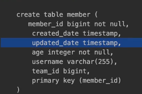

# 확장 기능

## 1. 사용자 정의 리포지토리 구현

- 스프링 데이터 JPA 리포지토리는 인터페이스만 정의하고 구현체는 스프링이 자동 생성 
- 스프링 데이터 JPA가 제공하는 인터페이스를 직접 구현하면 구현해야 하는 기능이 너무 많음 
- 다양한 이유로 인터페이스의 메서드를 직접 구현하고 싶다면? ex) MyBatis
  - JPA 직접 사용(EntityManager)
  - 스프링 JDBC Template 사용
  - MyBatis 사용
  - 데이터베이스 커넥션 직접 사용 등등...
  - Querydsl 사용

### 사용자 정의 인터페이스
```java
public interface MemberRepositoryCustom { 
    List<Member> findMemberCustom();
}
```

### 사용자 정의 인터페이스 구현 클래스
```java
@RequiredArgsConstructor
public class MemberRepositoryImpl implements MemberRepositoryCustom { 
    private final EntityManager em;
    @Override
    public List<Member> findMemberCustom() {
        return em.createQuery("select m from Member m")
                .getResultList();
    } 
}
```

JPA 기능이아닌 JDBC Template 으로 이렇게 데이터베이스에 직접 접근해서 네이티브 쿼리를 쓰고 싶어 할때 사용할 수 있다

이걸 이제 MemberRepository 가 알아야 되기 때문에

```java
public interface MemberRepository extends JpaRepository<Member, Long>, MemberRepositoryCustom {
}
```

이렇게 MemberRepository 가 상속받으면 된다 이렇게 하면 완성이 된다 
정리하면 
- MemberRepository 인터페이스가 MemberRepositoryCustom 인터페이스를 상속받았고
- MemberRepositoryCustom 인터페이스 가보면 findMemberCustom 이라는 기능이 있고
- 이 기능에 대한 구현은 MemberRepositoryImpl 에서 구현을 했다 여기에 있는 메소드가 실행이 된다 MemberRepositoryImpl 메소드명은 규칙이 있는데
MemberRepository 와 이름을 맞춰야 되고 거기에 Impl을 붙여줘야 된다
- spring 에서 제공하는 기능이다
- 스프링 데이터 JPA가 인식해서 스프링 빈으로 등록

```java
List<Member> result = memberRepository.findMemberCustom();
```
이렇게 실행 가능
복잡한 쿼리고 직접 DB에 붙어야되면 많이 쓰고 영한님은 Querydsl 쓸 때 자주 쓴다 하신다
참고: 항상 사용자 정의 리포지토리가 필요한 것은 아니다. 그냥 임의의 리포지토리를 만들어도 된다.
예를들어 MemberQueryRepository를 인터페이스가 아닌 클래스로 만들고 스프링 빈으로 등록해서 그냥 직접 사용해도 된다.
물론 이 경우 스프링 데이터 JPA와는 아무런 관계 없이 별도로 동작한다.

## 2. Auditing
- 엔티티를 생성, 변경할 때 변경한 사람과 시간을 추적하고 싶으면?
  - 등록일
  - 수정일 
  - 등록자
  - 수정자

왜 변경한 사람과 시간을 추적해야 할까? 등록일 수정일을 테이블에 꼭남겨 놔야지 운영할때 좋다 안남겨 놓으면 운영할때 지옥을 만난다 이 데이터를 언제 등록, 수정이
됬어? 이런거다

### 순수 JPA 사용

```java
@MappedSuperclass
  @Getter
  public class JpaBaseEntity {
      @Column(updatable = false)
      private LocalDateTime createdDate;
      private LocalDateTime updatedDate;
      @PrePersist
      public void prePersist() {
          LocalDateTime now = LocalDateTime.now();
          createdDate = now;
          updatedDate = now;
}
      @PreUpdate
      public void preUpdate() {
          updatedDate = LocalDateTime.now();
      }
}
```

@PrePersist 는 뭐냐면 Persist(저장) 하기 전에 해주는 메소드고 PerUpdate 는 update 하기 전에 해주는 메소드다  
PrePersist 에 update랑 create 둘다 넣어줘야 하는 이유는 쿼리 날릴때 편하고 이 데이터가 최초 등록된 데이터 인지도 알 수 있다
@MappedSuperclass 는 뭐냐면 진짜 상속관계가 있고 속성만 쓰는 상속관계가 있는데 후자에 해당하면 사용하는 어노테이션이다
이제 이 클래스를 사용하기 위해 Member 엔티티에 
```java
  public class Member extends JpaBaseEntity {}
```
이렇게 넣어주면 된다 이제 실행하면 Member 테이블 create 할때

created_date 와 update_date 가 생성된다

```java
@Test
  public void JpaEventBaseEntity() throws Exception {
//given
      Member member = new Member("member1");
      memberRepository.save(member); //@PrePersist
      Thread.sleep(100);
      member.setUsername("member2");
      em.flush(); //@PreUpdate
      em.clear();
//when
      Member findMember = memberRepository.findById(member.getId()).get();
//then
      System.out.println("findMember.createdDate = " +
  findMember.getCreatedDate());
      System.out.println("findMember.updatedDate = " +
  findMember.getUpdatedDate());
  }
```

save 할때 PrePersist 가 발생한다 그리고 sleep 한번 해주고 변경감지로 flush 하면 PreUpdate 가 된다

이렇게 공통으로 만들어놓고 사용하면 중복 코드를 줄일 수 있다 

### 스프링 데이터 JPA 사용 - 등록일, 수정일

더 깔끔하게 가능하다

@EnableJpaAuditing 스프링 부트 설정 클래스에 적용해야 한다

```java
@EntityListeners(AuditingEntityListener.class)
  @MappedSuperclass
  @Getter
  public class BaseEntity {
      @CreatedDate
      @Column(updatable = false)
      private LocalDateTime createdDate;
      @LastModifiedDate
      private LocalDateTime lastModifiedDate;
}

```
이렇게 더 간편하게 해줄 수 있다
@EntityListeners(AuditingEntityListener.class) 이건 넣어줘야 하는데 이벤트를 기반으로 동작하기 때문이다

그리고 엔티티에서 BaseEntity를 상속하면 된다

### 스프링 데이터 JPA 사용 - 등록자, 수정자

```java
@EntityListeners(AuditingEntityListener.class)
  @MappedSuperclass
  public class BaseEntity {
      @CreatedDate
      @Column(updatable = false)
      private LocalDateTime createdDate;
      @LastModifiedDate
      private LocalDateTime lastModifiedDate;
      @CreatedBy
      @Column(updatable = false)
      private String createdBy;
      @LastModifiedBy
      private String lastModifiedBy;
}

```

등록자는 혹시나 바뀔 수 있으니 @Column(updatable = false) 넣어 준다 그냥 이렇게 BaseEntity 에 등록자 수정자 넣어준다 해서 값이 들어가는게
아니라 이 경우에는 

```java

@Bean
public AuditorAware<String> auditorProvider() {
    return new AuditorAware<String>() {
        @Override
        public Optional<String> getCurrentAuditor() {
            return Optioinal.of(UUID.randomUUID().toString());
        }
    }
}
```
랜덤으로 그냥 넘겼다 AuditorAware 에 있는 getCurrentAuditor 를 구현하는 거다
등록자, 수정자를 처리해주는 AuditorAware 스프링 빈 등록을 해줘야 한다
여기선 그냥 랜덤으로 했지만 실무에서는 세션 정보나, 스프링 시큐리티 로그인 정보에서 ID를 받는다
그럼 createdBy, lastModifiedBy 가 사용 될 때마다 AuditorAware 에 auditorProvider 를 호출해서 결과물을 꺼내서 값이 채워진다

> 참고: 실무에서 대부분의 엔티티는 등록시간, 수정시간이 필요하지만, 등록자, 수정자는 없을 수도 있다.
> 그래서 다음과 같이 Base 타입을 분리하고, 원하는 타입을 선택해서 상속한다.

```java
public class BaseTimeEntity {
        @CreatedDate
        @Column(updatable = false)
        private LocalDateTime createdDate;
        @LastModifiedDate
        private LocalDateTime lastModifiedDate;
}

public class BaseEntity extends BaseTimeEntity {
        @CreatedBy
        @Column(updatable = false)
        private String createdBy;
        @LastModifiedBy
        private String lastModifiedBy;
}
```


