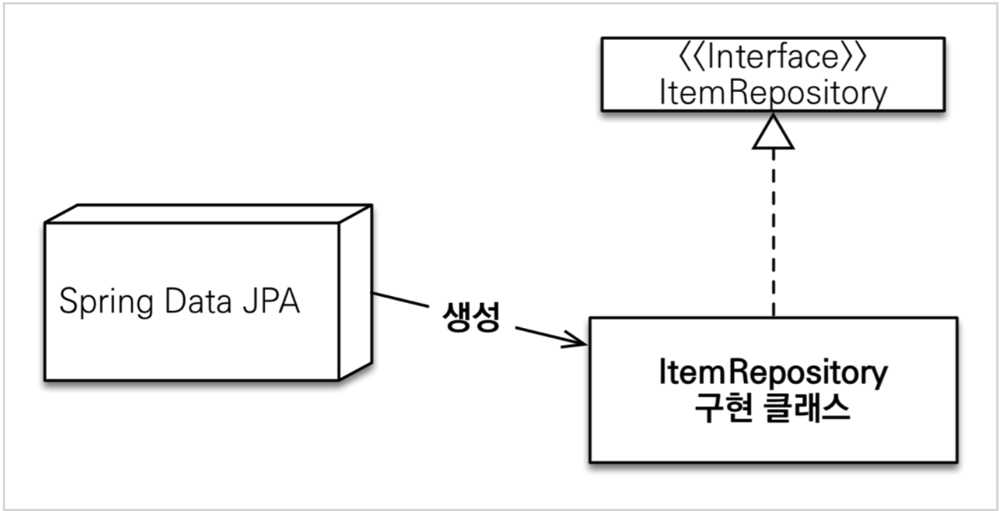
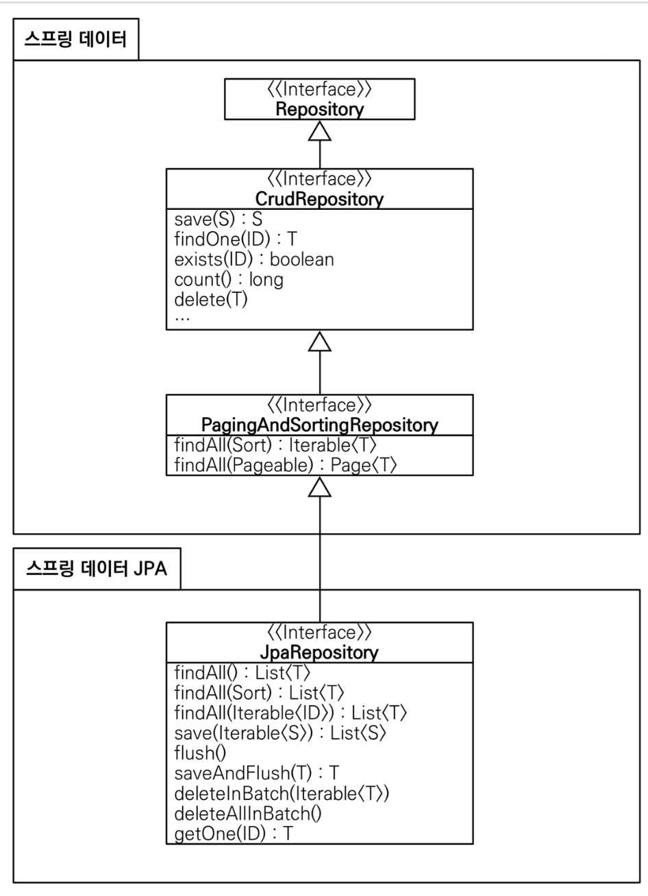

# 순수 JPA 기반 리포지토리 만들기

## 순수 JPA 기반 리포지토리 - 회원

```java
@Repository
public class MemberJpaRepository {
    
    @PersistenceContext
    private EntityManager em;
    
    public Member save(Member member) {
        em.persist(member);
        return member;
    }
    
    public void delete(Member member) {
        em.remove(member);
    }
    
    public List<Member> findAll() {
        return em.createQuery("select m from Member m", Member.class)
                .getResultList();
    }
    
    public Optional<Member> findById(Long id) {
        Member member = em.find(Member.class, id);
        return Optional.ofNullable(member);
    }
    public long count() {
        return em.createQuery("select count(m) from Member m", Long.class)
                .getSingleResult();
    }
    public Member find(Long id) {
        return em.find(Member.class, id);
    } 
}
```

## 순수 JPA 기반 레포지토리 - 팀

```java
@Repository
public class TeamJpaRepository {
    
    @PersistenceContext
    private EntityManager em;
    
    public Team save(Team team) {
        em.persist(team);
        return team;
    }

    public void delete(Team team) {
        em.remove(team);
    }
    
    public List<Team> findAll() {
        return em.createQuery("select t from Team t”, Team.class)
                .getResultList();
    }
    
    public Optional<Team> findById(Long id) {
        Team team = em.find(Team.class, id);
        return Optional.ofNullable(team);
    }
    
    public long count() {
        return em.createQuery("select count(t) from Team t”, Long.class)
                .getSingleResult();
    }
}
```

## 순수 JPA 기반 레포지토리 테스트

```java
@SpringBootTest
@Transactional
public class MemberJpaRepositoryTest {
    
    @Autowired
    MemberJpaRepository memberJpaRepository;
    
    @Test
    public void testMember() {
        Member member = new Member("memberA");
        Member savedMember = memberJpaRepository.save(member);
        Member findMember = memberJpaRepository.find(savedMember.getId());
        assertThat(findMember.getId()).isEqualTo(member.getId());
        assertThat(findMember.getUsername()).isEqualTo(member.getUsername()); assertThat(findMember).isEqualTo(member); //JPA 엔티티 동일성 보장
    }
    
    @Test
    public void basicCRUD() {
        Member member1 = new Member("member1");
        Member member2 = new Member("member2");
        memberJpaRepository.save(member1);
        memberJpaRepository.save(member2);
        
        //단건 조회 검증
        Member findMember1 = memberJpaRepository.findById(member1.getId()).get();
        Member findMember2 = memberJpaRepository.findById(member2.getId()).get();
        assertThat(findMember1).isEqualTo(member1);
        assertThat(findMember2).isEqualTo(member2);
        
        //리스트 조회 검증
        List<Member> all = memberJpaRepository.findAll(); assertThat(all.size()).isEqualTo(2);
        
        //카운트 검증
        long count = memberJpaRepository.count(); assertThat(count).isEqualTo(2);
        
        //삭제 검증 memberJpaRepository.delete(member1); memberJpaRepository.delete(member2);
        long deletedCount = memberJpaRepository.count();
        assertThat(deletedCount).isEqualTo(0);
    }
}
```

> 순수 JPA 기반의 레포지토리를 작성하였고 그 메서드들을 기반으로 CRUD 테스트까지 진행하였다. `team`과 `member` 에 이를 작성하였는데 로직이 반복되는 작업이라는 것이 눈에 보일 것이다.

# 공통 인터페이스 설정


* 스프링 데이터 JPA 기반 MemberRepository
```java
public interface MemberRepository extends JpaRepository<Member, Long> {}
```

이번에는 순수 JPA 기반 리포지토리 대신 위와같은 `MemberRepository` 를 만들어서 테스트에 사용해 보도록 하자.

```java
@SpringBootTest
@Transactional
public class MemberRepositoryTest {
    // 레포지토리를 MemberJpaRepository -> MemberRepository 로 수정 !
    @Autowired
    MemberRepository memberRepository;
    
    ... 나머지는 위의 테스트 로직과 동일
}
```

위의 테스트를 돌려보면 성공적으로 실행된다. 그런데 왜?? 분명 `MemberRepository` 는 `interface` 에 `default method` 조차 없다.
이 궁금증을 해결해보기 위해 위 테스트 로직에서 `MemberRepository` 를 찍어보면 
`memberRepository.getClass()`의 결과로 `class com.sun.proxy.$ProxyXXX` 다음과 같이 프록시 객체가 찍히며
이것이 의미하는것은 스프링 컨테이너가 만든 구현체를 DI 해주어서 그 구현체를 사용하게 되는것이다.

>  @Repository 애노테이션은 생략이 가능하다.
이때, 컴포넌트 스캔을 스프링 데이터 JPA가 자동으로 처리하며 , JPA 예외를 스프링 예외로 변환하는 과정도 자동으로 처리한다.



## TeamRepository 생성

```java
public interface TeamRepository extends JpaRepository<Team, Long> {}
```

> 위의 generic이 의미하는 것 
> * T: 엔티티 타입
> * ID: 식별자 타입(PK)


## 공통 인터페이스 분석

```java
@NoRepositoryBean
public interface JpaRepository<T, ID> extends PagingAndSortingRepository<T, ID>, QueryByExampleExecutor<T> {

	/*
	 * (non-Javadoc)
	 * @see org.springframework.data.repository.CrudRepository#findAll()
	 */
	@Override
	List<T> findAll();

    ... 나머지 메서드를 정의
}
```

```java
@NoRepositoryBean
public interface PagingAndSortingRepository<T, ID> extends CrudRepository<T, ID> {

	/**
	 * Returns all entities sorted by the given options.
	 *
	 * @param sort the {@link Sort} specification to sort the results by, can be {@link Sort#unsorted()}, must not be
	 *          {@literal null}.
	 * @return all entities sorted by the given options
	 */
	Iterable<T> findAll(Sort sort);

	/**
	 * Returns a {@link Page} of entities meeting the paging restriction provided in the {@link Pageable} object.
	 *
	 * @param pageable the pageable to request a paged result, can be {@link Pageable#unpaged()}, must not be
	 *          {@literal null}.
	 * @return a page of entities
	 */
	Page<T> findAll(Pageable pageable);
}
```

```java
@NoRepositoryBean
public interface CrudRepository<T, ID> extends Repository<T, ID> {

	/**
	 * Saves a given entity. Use the returned instance for further operations as the save operation might have changed the
	 * entity instance completely.
	 *
	 * @param entity must not be {@literal null}.
	 * @return the saved entity; will never be {@literal null}.
	 * @throws IllegalArgumentException in case the given {@literal entity} is {@literal null}.
	 * @throws OptimisticLockingFailureException when the entity uses optimistic locking and has a version attribute with
	 *           a different value from that found in the persistence store. Also thrown if the entity is assumed to be
	 *           present but does not exist in the database.
	 */
	<S extends T> S save(S entity);

    ... 나머지 메서드 정의
}
```

```java
@Indexed
public interface Repository<T, ID> {}
```

>`JpaRepository` 를 까보면 다음과 위와 코드가 있고 `JpaRepository` 는 `PagingAndSortingRepository` 를 상속하며 그 상위 인터페이스로 `CrudRepository` 그리고 그 상위 인터페이스로 `Repository` 가 있다.



그림으로는 위와 같은 구조이다. 위의 그림에서 `PagingAndSortingRepository` , `CrudRepository` , `Repository` 는 공통 인터페이스로 디비를 다룰때 공통적으로 가지고 있는 메서드들을 정의해 놓았고
그리고 `JpaRepository` 는 JPA에 특화된 기능(RDS)이 정의 되어있다.

> `PagingAndSortingRepository` 를 상속하는 인터페이스로 mongo 디비를 다룰 수 있게 하는 인터페이스나 혹은 Redis 디비를 다루기 위한 메서드들이 정의된 인터페이스도 있다.

## 주요 메서드

* save(S) : 새로운 엔티티는 저장하고 이미 있는 엔티티는 병합한다.
* delete(T) : 엔티티 하나를 삭제한다. 내부에서 EntityManager.remove() 호출
* findById(ID) : 엔티티 하나를 조회한다. 내부에서 EntityManager.find() 호출
* getOne(ID) : 엔티티를 프록시로 조회한다. 내부에서 EntityManager.getReference() 호출 findAll(...) : 모든 엔티티를 조회한다. 정렬( Sort )이나 페이징( Pageable ) 조건을 파라미터로 제공할
수 있다.
> 참고: JpaRepository 는 대부분의 공통 메서드를 제공한다.

