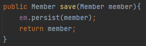
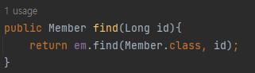
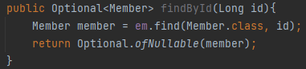
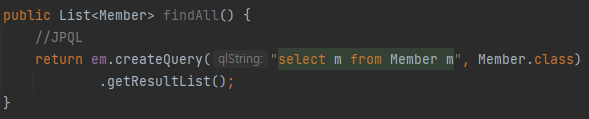
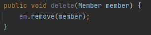
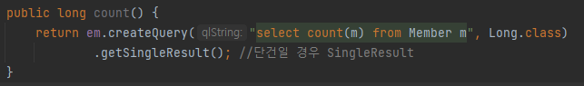
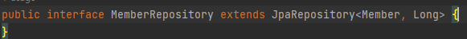
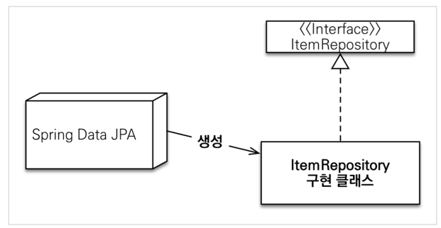

# 공통 인터페이스 기능

## 순수 JPA 기반 리포지토리 만들기

### 기본 CRUD
#### Create

#### Read
#### 단건조회

#### 전체 조회

#### Delete

#### Count

TeamRepository도 위 코드와 유사하게 CRUD를 작성할 수 있다.  
그렇다면 왜 `update문`은 안만들었나요? -> JPA에서는 `변경감지(더티체킹)` 기능이 있기때문에 엔티티를 수정하면 자동으로 update 쿼리를 날려주기 때문이다.

## 공통 인터페이스 설정

지난시간에 다음과 같은 JPARepository 인터페이스를 테스트 해보았다. 구현체가 따로 없는데 어떻게 동작하는 걸까?  
-> 인터페이스를 보고 `Sprind Data JPA`가 대신 구현 클래스를 생성 해준다.

+ @Repository 애노테이션 생략 가능
  + 컴포넌트 스캔을 스프링 데이터 JPA가 자동으로 처리
  + JPA 예외를 스프링 예외로 변환하는 과정도 자동으로 처리 

## 공통 인터페이스 적용

순수JPA를 통해 만든 MemberJPARepository를 테스트한 코드 그대로 인터페이스로 만든 MemberRepository 로 옮겨서
테스트를 진행해본 결과 똑같이 테스트를 통과하는 것을 볼 수 있었다.   
-> 순수JPA를 이용하여 만든 CRUD 코드와 SpringDataJPA가 만든 구현 클래스와 거의 유사하기때문에 테스트가 통과할 수 있던 것이다.   

## 공통 인터페이스 분석

#### 공통 인터페이스 구성

`Repository -> CrudRepository -> PagingAndSortingRepository` 는 Spring-data-commons library에 속해있고 어떤 DB를 사용하던 간에 공통적으로 쓰이는 부분이다.  

JpaRepository는 JPA에 특화된 기능만 제공을 한다.

#### 주요 메서드
+ save(S) : 새로운 엔티티는 저장하고 이미 있는 엔티티는 병합한다.
+ delete(T) : 엔티티 하나를 삭제한다. 내부에서 EntityManager.remove() 호출
+ findById(ID) : 엔티티 하나를 조회한다. 내부에서 EntityManager.find() 호출
+ getOne(ID) : 엔티티를 프록시로 조회한다. 내부에서 EntityManager.getReference() 호출
+ findAll(…) : 모든 엔티티를 조회한다. 정렬( Sort )이나 페이징( Pageable ) 조건을 파라미터로 제공할
수 있다