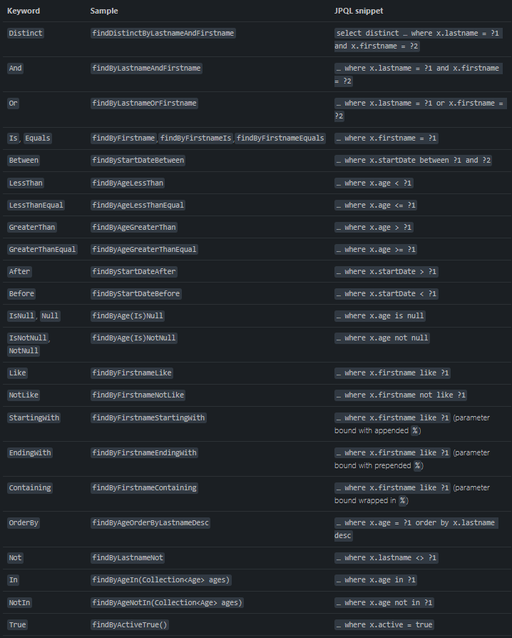
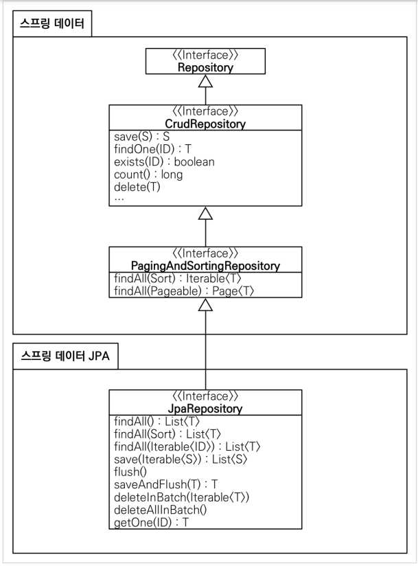

# 쿼리 메소드 기능

## 메소드 이름으로 쿼리 생성

가령 이름과 나이를 기준으로 회원을 검색하고 싶다면

### 순수 JPA 리포지토리를 통해 만들기

```java
public List<Member> findByUsernameAndAgeGreaterThan(String username,int age){
        return em.createQuery("select m from Member m where m.username =:username and m.age > :age")
        .setParameter("username",username)
        .setParameter("age",age)
        .getResultList();
        }
```

간단한 코드지만 직접 짜야하는 번거로움이 존재한다.

### 스프링 데이터 JPA

```java
List<Member> findByUsernameAndAgeGreaterThan(String username,int age)
```

메소드 이름을 기반으로 스프링 데이터 JPA가 위와 동일한 코드를 생성해준다.

그렇다면 어떤 조건을 통해 메소드 이름을 지어야 할까??

### 쿼리 메소드 필터 조건

스프링 데이터 JPA 공식 문서를 참고하면
된다(https://docs.spring.io/spring-data/jpa/docs/current/reference/html/#jpa.query-methods.query-creation)


### 스프링 데이터 JPA가 제공하는 쿼리 메소드 기능

+ 조회: find…By ,read…By ,query…By get…By, 예:) findHelloBy 처럼 ...에 식별하기 위한 내용(설명)이 들어가도 된다.
+ COUNT: count…By 반환타입 `long`
+ EXISTS: exists…By 반환타입 `boolean`
+ 삭제: delete…By, remove…By 반환타입 `long`
+ DISTINCT: findDistinct, findMemberDistinctBy
+ LIMIT: findFirst3, findFirst, findTop, findTop3

참고 : 엔티티의 필드명이 변경되면 인터페이스에 정의한 메서드 이름도 꼭 함께 변경해야 한다.
그렇지 않으면 애플리케이션을 시작하는 시점에 오류가 발생한다

짤막한 쿼리들은 다음과 같이 해결할 수 있지만 복잡한 쿼리는 어떻게 해결해야 할까??

## 메소드 이름으로 JPA NamedQuery 쿼리 호출

### JPA NamedQuery

JPA 는 쿼리에 이름을 부여하고 호출하는 기능인 NamedQuery를 제공한다.

```java

@NamedQuery(name = "Member.findByUsername", query = "select m from Member m where m.username = :username")
public class Member {
    ...
}


@Repository
public class MemberJpaRepository {
    ...

    public List<Member> findByUsername(String username) {
        em.createNamedQuery("Member.findByUsername", Member.class)
                .setParameter("username", username)
                .getResultList();
    }
    ...
}
```

```java
@Query(name = "Member.findByUsername")
List<Member> findByUsername(@Param("username") String username)
```

스프링 데이터 JPA가 다음과 같이 짧은 코드로 NamedQuery 호출할 수 있도록 해준다.  
추가) JPQL 을 명확하게 작성했을 경우 Member 에서 작성한 NamedParameter가 넘어가야 하기 때문에 @Param 어노테이션을 사용해야 한다.

```java
//@Query(name = "Member.findByUsername")
List<Member> findByUsername(@Param("username") String username)
```

주석 처리를 한 뒤에도 JPA 관례의 의해 Member.findByUsername 으로 NamedQuery를 먼저 찾게되기때문에 똑같이 동작한다.

NamedQuery는 Application 로딩 시점에 파싱을 통해 JPQL을 SQL로 변환하는 작업을 하기 때문에 그 시점에 오류를 잡아낼 수 있다.

## @Query, 리포지토리 메소드에 쿼리 정의하기

```java
@Query("SELECT m FROM Member m WHERE m.username = :username and m.age = :age")
List<Member> findUser(@Param("username") String username,@Param("age") int age);
```

+ 실행할 메서드에 정적 쿼리를 직접 작성하므로 이름 없는 Named 쿼리라 할 수 있음
+ JPA Named 쿼리처럼 애플리케이션 실행 시점에 문법 오류를 발견할 수 있음(매우 큰 장점!)

## @Query를 통해 값,DTO 조회하기

### 단순히 값 하나를 조회

```java
@Query("select m.username from Member m")
List<String> findUsernameList();
```

### DTO로 직접 조회

```java
public class MemberDto {

    private Long id;
    private String username;
    private String teamName;

    public MemberDto(Long id, String username, String teamName) {
        this.id = id;
        this.username = username;
        this.teamName = teamName;
    }
}
```

DTO를 다음과 같이 만들어 주고

```java
@Query("select new study.datajpa.dto.MemberDto(m.id, m.username, t.name) from Member m join m.team t")
List<MemberDto> findMemberDto();
```

마치 객체를 생성하여 반환하는 것처럼 DTO 반환해준다.

## 파라미터 바인딩

```sql
select m
from Member m
where m.username = ?0 // 위치 기반
select m
from Member m
where m.username = :name // 이름 기반
```

코드 가독성과 유지보수를 위해 가급적 이름 기반을 사용하는 것을 권장한다.

```java
@Query("select m from Member m where m.username = :name")
Member findMembers(@Param("name") String username);
```

### 컬렉션 파라미터 바인딩

```java
@Query("SELECT m FROM Member m WHERE m.username in :names")
List<Member> findByNames(@Param("names") Collection<String> names);
```

Collection 타입으로 in 절을 지원하기 때문에 활용 가능하다.

## 반환 타입

스프링 데이터 JPA는 유연한 반환 타입을 지원한다.

```java
 List<Member> findListByUsername(String name); //컬렉션
 Member findMemberByUsername(String name); //단건
 Optional<Member> findOptionalByUsername(String name); //단건 Optional
```

### 조회 결과가 더 많거나 없으면
+ 컬렉션
  + 결과 없음 : 빈 컬렉션 반환
+ 단건 조회
  + 결과 없음: `null` 반환
  + 결과 2건 이상 : `javax.persistence.NonUniqueResultException` 예외 발생

참고: 단건 조회(Query.getSingleResult() 메서드)에서의 결과 없음은 `javax.persistence.NoResultException` 예외가 발생하는데 개발자 입장에서 다루기 불편하다.  
따라서 스프링 데이터 JPA는 단건을 조회할때 이 예외가 발생하면 예외를 무시하고 대신 `null`을 반환한다.

자바 8이상부터는 반환 데이터가 있는지 없는지 모를때 `Optional 타입`을 사용하면 된다.  
#### 그렇다면 Optional 단건 조회에서 결과값이 두개면 어떻게 될까?
예외가 터지게 된다 (스프링프레임워크 Exception:`IncorrectResultSizeDataAccessException`)


## 순수 JPA 페이징과 정렬

#### 예제코드 살펴보기
+ 검색 조건: 나이가 10살
+ 정렬 조건: 이름으로 내림차순
+ 페이징 조건: 첫번째 페이지, 페이지당 보여줄 데이터는 3건

```java
    public List<Member> findByPage(int age, int offset, int limit) {
        return em.createQuery("select m from Member m where m.age = :age order by m.username desc ")
        .setParameter("age", age)
        .setFirstResult(offset)  //어디서 부터 가져올 것인지(인덱스) offset = 0
        .setMaxResults(limit)    //개수를 몇개 가져올 건지  limit = 3
        .getResultList();
        }

    public long totalCount(int age) {   //데이터 총 개수
        return em.createQuery("select count(m) from Member m where m.age = :age", Long.class)
        .setParameter("age", age)
        .getSingleResult();
        }
```

```java
@Test
    public void paging() {
        //given
        memberJpaRepository.save(new Member("member1",10));
        memberJpaRepository.save(new Member("member2",10));
        memberJpaRepository.save(new Member("member3",10));
        memberJpaRepository.save(new Member("member4",10));
        memberJpaRepository.save(new Member("member5",10));

        //page1 -> offset=0, limit=10, page2 -> offset=10, limit=10

        int age = 10;
        int offset = 0;
        int limit = 3;

        //when
        List<Member> members = memberJpaRepository.findByPage(age, offset, limit);
        long totalCount = memberJpaRepository.totalCount(age);

        //페이지 계산 공식 적용...
        // totalPage = totalCount / size ...
        // 마지막 페이지 ...
        // 최초 페이지 ..

        //then
        assertThat(members.size()).isEqualTo(3);
        assertThat(totalCount).isEqualTo(5);

    }
```

## 스프링 데이터 JPA 페이징과 정렬

#### 페이징과 정렬 파라미터
+ `패키지명:org.springframework.data.domain.Sort` : 정렬 기능
+ `패키지명:org.springframework.data.domain.Pageable` : 페이징 기능 (내부에 Sort 포함)



`Spring-data-commons library`에 속해있고 어떤 DB를 사용하던 간에 공통적으로 쓸수있음.
그 말은 즉, Sort,Pageable 인터페이스 두개로 페이징을 공통화 시켰다고 할 수 있다.

#### 특별한 반환 타입
+ Page : 추가 count 쿼리 결과를 포함하는 페이징
+ Slice : 추가 count 쿼리 없이 다음 페이지만 확인 가능(내부적으로 limit + 1조회)
+ List : 추가 count 쿼리 없이 결과만 반환

#### Slice,Page,List 사용 예제코드
```java
public interface MemberRepository extends Repository<Member, Long> {
  Page<Member> findPageByAge(int age, Pageable pageable); 
  Slice<Member> findSliceByAge(int age, Pageable pageable); 
  List<Member> findListByAge(int age, Pageable pageable);
}
```
```java
//페이징 조건과 정렬 조건 설정
@Test
public void paging(){
        // given
        memberRepository.save(new Member("member1", 10));
        memberRepository.save(new Member("member2", 10));
        memberRepository.save(new Member("member3", 10));
        memberRepository.save(new Member("member4", 10));
        memberRepository.save(new Member("member5", 10));

        int age = 10;
        PageRequest pageRequest = PageRequest.of(0, 3, Sort.by(Sort.Direction.DESC, "username"));
        // PageRequest(구현체)의 부모를 타고가다보면 Pageable interface가 있음.
        // page 1이 아니라 0부터 시작
        // Slice에서는 3개가 아닌 4개를 가져오게됨 이로 인해서 totalCount 쿼리 없이 다음페이지 여부를 알수있게된다.
        
        // when
        Page<Member> page = memberRepository.findPageByAge(age, pageRequest);
        Slice<Member> slice = memberRepository.findSliceByAge(age, pageRequest);
        List<Member> list = memberRepository.findListByAge(age, pageRequest);

        // then
        // 1) Page - totalCount쿼리 날라감
        List<Member> content = page.getContent();

        assertThat(content.size()).isEqualTo(3); // 개수
        assertThat(page.getTotalElements()).isEqualTo(5); // 총 개수
        assertThat(page.getNumber()).isEqualTo(0); // 현재 페이지
        assertThat(page.getTotalPages()).isEqualTo(2); // 총 페이지 수
        assertThat(page.isFirst()).isTrue(); // 첫번째 페이지인지
        assertThat(page.hasNext()).isTrue();// 다음 페이지 있는지 여부


        // 2. Slice
        // Slice는 total 관련 함수들 지원 X
        List<Member> content_slice = slice.getContent();

        assertThat(content_slice.size()).isEqualTo(3);
//      assertThat(slice.getTotalElements()).isEqualTo(5);
        assertThat(slice.getNumber()).isEqualTo(0);
//      assertThat(slice.getTotalPages()).isEqualTo(2);
        assertThat(slice.isFirst()).isTrue();
        assertThat(slice.hasNext()).isTrue();


        // 3.List
        // 위의 함수들이 필요없고 갯수만 맞춰서 가져오고 싶을때 사용
```


```
Page는 totalCount 쿼리를 사용하기때문에 DB에있는 모든 데이터를 조회하게되서 성능이 떨어진다.
따라서 반환타입을 Slice로 변경해주면 성능 문제가 완화된다.
```


### count Query 분리
left outer join을 한다고 가정했을때, join 테이블의 count값과 join을 하지 않을때의 count 값이 같다.  
그럼 둘중에 아무거나 사용하면 되는거 아닌가? join 테이블에서 count 값을 가져올때는 join을 해서 가져게 되므로 성능 이슈가 발생한다.  
그렇기 때문에 count 쿼리를 분리하여 join 하지 않은 테이블에서 count 값을 가져오는게 성능 면에서 우수하다.

```java
// totalCount 성능 최적화를 위한, 쿼리 분리(값 가져오는 쿼리, totalCount 쿼리)
@Query(value = "select m from Member m left join m.team t",
 countQuery = "select count(m.username) from Member m")
Page<Member> findMemberAllCountBy(Pageable pageable)
```

### 페이지 DTO 변환
api 로 반환할때 Entity는 노출시키면 안되므로 항상 DTO로 변환해서 넘겨야함. 
Page 반환 타입일때는 어떻게 변환 시키지? Page 를 유지하면서 DTO로 변환이 가능함
```java
Page<Member> page = memberRepository.findByAge(age,pageRequest);

Page<MemberDto> toMap = page.map(member -> new MemberDto(member.getId(), member.getUsername(), null)); 
```

## 벌크성 수정 쿼리
JPA는 데이터를 변경하게 되면 변경감지에 의해서 트랜잭션 커밋시점에 update 쿼리를 날리게 된다.(단건 처리)  
하지만 모든 직원의 연봉을 10% 올린다고 가정해보자.하나씩 끌어와서 하는 것 보다는 DB에 update 쿼리를 날려 일괄적으로 처리하는 것이 편할 것이다.   
이렇게 일괄적으로 한번에 처리하는 쿼리를 `벌크성 쿼리` 라고 한다.


순수 JPA를 사용한 벌크성 수정 쿼리
```java
public int bulkAgePlus(int age) {
        int resultCount = em.createQuery(
        "update Member m set m.age = m.age + 1" +
        "where m.age >= :age")
        .setParameter("age", age)
        .executeUpdate();
        return resultCount;
}
```

스프링 데이터 JPA를 사용한 벌크성 수정 쿼리
```java
@Modifying   //excuteUpdate를 호출하기 위해 꼭 필요하다.(안쓰면 getResultList, getSingleResult를 호출)
@Query("update Member m set m.age = m.age + 1 where m.age >= :age")
int bulkAgePlus(@Param("age") int age);
```

+ 벌크성 수정, 삭제 쿼리는 `@Modifying` 어노테이션을 사용
  + 사용하지 않으면 `org.hibernate.hql.internal.QueryExecutionRequestException: Not supported for DML operations` 예외 발생
+ JPA는 영속성컨텍스트에 의해서 엔티티들이 관리가 되어야 하는데 벌크연산은 그것들을 무시하고 DB에 바로 쿼리를 날리게 된다.따라서 벌크연산을 수행한 후에
영속성 컨텍스트를 비워주는 것이 좋다.(em.clear() 혹은 @Modifying(clearAutomatically = true))

```java
@Test
public void bulkUpdate() throws Exception {
 //given
 memberRepository.save(new Member("member1", 10));
 memberRepository.save(new Member("member2", 19));
 memberRepository.save(new Member("member3", 20));
 memberRepository.save(new Member("member4", 21));
 memberRepository.save(new Member("member5", 40));
 //when
 int resultCount = memberRepository.bulkAgePlus(20);
 em.clear();
 
 List<Member> result = memberRepository.findByUsername("member5");
 Member member5 = result.get(0);
 //40살일까 41살일까?
 
 //then
 assertThat(resultCount).isEqualTo(3);
}
```