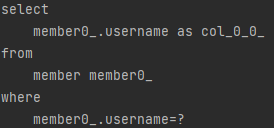
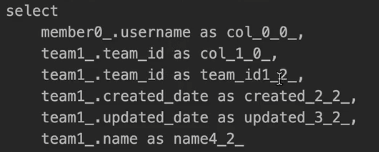
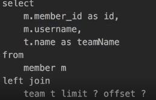

# 나머지 기능들

## Specifications (명세)

>책 도메인 주도 설계(Domain Driven Design)는 SPECIFICATION(명세)라는 개념을 소개 스프링 데이터 JPA는 JPA Criteria를 활용해서 이 개념을 사용할 수 있도록 지원

실무에서 사용 금지..(읽기 어려움)


### 술어(predicate)로 이루어짐
+ 참 또는 거짓으로 평가
+ AND OR 같은 연산자로 조합해서 다양한 검색조건을 쉽게 생성(컴포지트 패턴) 
+ 예) 검색 조건 하나하나
+ 스프링 데이터 JPA는 `org.springframework.data.jpa.domain.Specification` 클래스로 정의


### Specification(명세) 기능 사용 방법

```java
public interface MemberRepository extends JpaRepository<Member, Long>, JpaSpecificationExecutor<Member> {

}
```
명세 기능을 사용하려면 JpaSpecificationExecutor 인터페이스를 상속받으면 된다.


```java
public interface JpaSpecificationExecutor<T> {
    
 Optional<T> findOne(@Nullable Specification<T> spec);
 List<T> findAll(Specification<T> spec);
 Page<T> findAll(Specification<T> spec, Pageable pageable);
 List<T> findAll(Specification<T> spec, Sort sort);
 long count(Specification<T> spec);
 
}
```
Specification을 파라미터로 받아 검색 조건으로 사용한다.

### `MemberSpec` 명세 정의 코드

```java
public class MemberSpec {
    public static Specification<Member> teamName(final String teamName) {
    return (Specification<Member>) (root, query, builder) -> {
        if (StringUtils.isEmpty(teamName)) {
        return null;
        }
        
        Join<Member, Team> t = root.join("team", JoinType.INNER); //회원과 조인
        return builder.equal(t.get("name"), teamName);
        };
    }
    
    public static Specification<Member> username(final String username) {
        return (Specification<Member>) (root, query, builder) ->
            builder.equal(root.get("username"), username);
    }
}
```
명세를 정의하려면 Specification 인터페이스를 구현
명세를 정의할 때는 toPredicate(...) 메서드만 구현하면 되는데 JPA Criteria의 Root , CriteriaQuery , CriteriaBuilder 클래스를 파라미터 제공


### 명세 사용 코드
```java
@Test
public void specBasic() throws Exception {
 //given
 Team teamA = new Team("teamA");
 em.persist(teamA);
 Member m1 = new Member("m1", 0, teamA);
 Member m2 = new Member("m2", 0, teamA);
 em.persist(m1);
 em.persist(m2);
 em.flush();
 em.clear();
 //when
 //"SELECT m FROM Member m WHERE m.username = :username AND m.teamName = :teamName"
 Specification<Member> spec = MemberSpec.username("m1").and(MemberSpec.teamName("teamA"));
 List<Member> result = memberRepository.findAll(spec);
 //then
 Assertions.assertThat(result.size()).isEqualTo(1);
}
```
Specification 을 구현하면 명세들을 조립할 수 있음. where() , and() , or() , not() 제공
findAll을 보면 회원 이름 명세(username)과 팀 이름 명세(teamName)를 and로 조합해 검색 조건으로 사용한다.

Criteria 기술을 통해 동적쿼리를 편하게 하려고 만들었지만..너무 번잡하다

> 참고: 실무에서는 JPA Criteria를 거의 안쓴다! 대신에 QueryDSL을 사용하자.


---
## Query By Example

Specification 과 비슷하게 이전과 같이 쿼리를 하는데 Example에 의해 쿼리를 하겠다(?) 


```java
@SpringBootTest
@Transactional
public class QueryByExampleTest {
     @Autowired MemberRepository memberRepository;
     @Autowired EntityManager em;
     
     @Test
     public void basic() throws Exception {
     //given
     Team teamA = new Team("teamA");
     em.persist(teamA);
     em.persist(new Member("m1", 0, teamA));
     em.persist(new Member("m2", 0, teamA));
     em.flush();
     
     //when
     //Probe 생성
     Member member = new Member("m1");  //멤버 엔티티 자체가 검색 조건이 된다.
     Team team = new Team("teamA"); //내부조인으로 teamA 가능
     member.setTeam(team);
     
     //ExampleMatcher 생성, age는 자바 기본형이므로 null을 가질수 없다. 따라서 무시하는 조건을 넣어줘야 한다.
     ExampleMatcher matcher = ExampleMatcher.matching().withIgnorePaths("age");
     Example<Member> example = Example.of(member, matcher); 
     List<Member> result = memberRepository.findAll(example);
     
     //then
     assertThat(result.size()).isEqualTo(1);
     }
}
```
`Probe`란 필드에 데이터가 있는 실제 도메인 객체  
`ExampleMatcher`는 특정 필드를 일치시키는 상세한 정보를 제공하며 재사용이 가능  
`Example`: `Probe`와 `ExampleMatcher`로 구성되었으며 쿼리를 생성하는데 사용  

### 장점
+ 동적 쿼리를 편리하게 처리
+ 도메인 객체를 그대로 사용
+ (이게 좋음!) 데이터 저장소를 RDB에서 NOSQL로 변경해도 코드 변경이 없게 추상화 되어있음 (DB에 구애받지 않음)
+ 스프링 데이터 JPA `JpaRepository` 인터페이스에 이미 포함 (repository를 받으면 그냥 쓸 수 있음)

### 단점
조인이 안되면 실무에 도입하지 않는 편

+ 조인은 가능하지만 내부조인(INNER JOIN)만 가능하고 외부조인(LEFT JOIN)은 안됨
+ 다음과 같은 중첩 제약 조건 안됨
  - firstname = ?0 or (firstname = ?1 and lastname = ?2)
+ 매칭 조건이 매우 단순
  - 문자는 starts/contains/ends/regex
  - 다른 속성은 정확한 매칭(=)만 지원 (equal 정도만 지원한다고 보면 됨)


### 정리
> 실무에서 사용하기에는 매칭 조건이 너무 단순하고, LEFT 조인이 안됨 실무에서는 QueryDSL을 사용하자


---

## Projections

이건 그래도 좀 쓸모가 있어서 알아두면 좋다!쿼리의 `Select 절`에 들어갈 Data 라고 생각하면 된다.

엔티티 대신 DTO를 편리하게 조회할 때 사용한다. 예를 들어 전체 엔티티가 아니라 회원 이름만 조회하고 싶을때 사용

```java
public interface UsernameOnly {
 String getUsername();
}
```
인터페이스에 getUsername()만 만들어놓으면 실제 구현체는 스프링 데이터 JPA가 만들어줌
조회할 엔티티의 필드를 getter 형식으로 지정하면 해당 필드만 선택해서 조회(Projection)
```java
public interface MemberRepository ... {
 List<UsernameOnly> findProjectionsByUsername(String username);
}
```

```java
@Test
public void projections() throws Exception {
        //given
        Team teamA = new Team("teamA");
        em.persist(teamA);
        
        Member m1 = new Member("m1", 0, teamA);
        Member m2 = new Member("m2", 0, teamA);
        
        em.persist(m1);
        em.persist(m2);
        
        em.flush();
        em.clear();
        
        //when
        List<UsernameOnly> result = memberRepository.findProjectionsByUsername("m1");
        
        //then
        Assertions.assertThat(result.size()).isEqualTo(1);
    }
```
 

다음과 같이 username 만 가져오는 쿼리가 생성된다.


### 인터페이스 기반 Open Proejections : 
스프링의 SpEL 문법도 지원 단, SpEL 문법을 사용하면, DB에서 엔티티 필드를 다 조회해온 다음 계산한다. 따라서 최적화가 안된다.
추가) Close Projections : Select 절 최적화가 된다

```java
public interface UsernameOnly {
 @Value("#{target.username + ' ' + target.age + ' ' + target.team.name}")
 String getUsername();
}
```

### 클래스 기반 Projection
인터페이스가 아닌 구체적인 DTO 형식도 Projection이 가능하다.  
생성자의 파라미터 이름으로 매칭됨
```java
public class UsernameOnlyDto {
    private final String username;

    public UsernameOnlyDto(String username) {  //생성자의 파라미터 이름으로 매칭을 시켜서 Projection 하게 된다.
        this.username = username;
    }
    public String getUsername() {
        return username;
    }
}
```

### 동적 Projection

```java
<T> List<T> findProjectionsByUsername(String username, Class<T> type);

List<UsernameOnly> result = memberRepository.findProjectionsByUsername("m1",UsernameOnly.class);
List<UsernameOnlyDto> result = memberRepository.findProjectionsByUsername("m1",UsernameOnlyDto.class);
```
Generic type을 주면 동적으로 프로젝션 데이터를 변경할 수 있다.


### 중첩 구조 처리
```java
public interface NestedClosedProjection {
    
    String getUsername(); //중첩구조에서는 root 는 최적화가 된다.
    TeamInfo getTeam(); // 두번째 부터는 최적화가 되지않는다
    
    interface TeamInfo {
    String getName();
    }
}
```


주의!)
+ 프로젝션 대상이 root 엔티티면, JPQL SELECT 절 최적화 가능
+ 프로젝션 대상이 ROOT가 아니면 LEFT OUTER JOIN 처리 모든 필드를 SELECT해서 엔티티로 조회한 다음에 계산


### 정리
+ 프로젝션 대상이 root 엔티티면 유용하다.
+ 프로젝션 대상이 root 엔티티를 넘어가면 JPQL SELECT 최적화가 안된다!
+ 실무의 복잡한 쿼리를 해결하기에는 한계가 있다.
+ 실무에서는 단순할 때만 사용하고, 조금만 복잡해지면 QueryDSL을 사용하자


## 네이티브 쿼리 

가급적 네이티브 쿼리는 사용하지 않는게 좋음  
과거에는 Spring Data JPA를 가지고 네이티브 쿼리를 쓰기 쉽지 않았는데 최근에 나온 `스프링 데이터 Projections`를 사용하면 좋음.


### 스프링 데이터 JPA 기반 네이티브 쿼리

예제 코드
```java
public interface MemberRepository extends JpaRepository<Member, Long> {
 @Query(value = "select * from member where username = ?", nativeQuery = true)
 Member findByNativeQuery(String username);
}
```
반환 타입 : Object[] , Tuple , DTO(스프링 데이터 인터페이스 Projections 지원)

제약
+ Sort 파라미터를 통한 정렬이 정상 동작하지 않을 수 있음(믿지 말고 직접 처리)
+ JPQL처럼 애플리케이션 로딩 시점에 문법 확인 불가
+ 동적 쿼리 불가

특징 :
+ JPQL은 위치 기반 파리미터를 1부터 시작하지만 네이티브 SQL은 0부터 시작
+ 네이티브 SQL을 엔티티가 아닌 DTO로 변환하려면(예시: username 만 반환하고 싶을때) 
  + DTO 대신 JPA TUPLE,MAP 조회
  + @SqlResultSetMapping 복잡
  + Hibernate ResultTransformer를 사용해야함 복잡
  + **네이티브 SQL을 DTO로 조회할 때는 JdbcTemplate or myBatis 권장**


그러나,네이티브 쿼리 & 정적쿼리를 DTO를 뽑을때 좋은것이 최근에 나왔다 바로 `스프링 데이터 Projection`

### Projections 활용
예) 스프링 데이터 JPA 네이티브 쿼리 + 인터페이스 기반 Projections 활용(정적 쿼리)
```java
@Query(value = "SELECT m.member_id as id, m.username, t.name as teamName " +
                "FROM member m left join team t ON m.team_id = t.team_id",
                countQuery = "SELECT count(*) from member",
                nativeQuery = true)
Page<MemberProjection> findByNativeProjection(Pageable pageable); //id,Username,TeamName 속성을 가져옴
```

```java
public interface MemberProjection {

    Long getId();
    String getUsername();
    String getTeamName();
}
```





### 동적 네이티브 쿼리
하이버네이트를 직접 활용, 스프링 JdbcTemplate, myBatis, jooq같은 외부 라이브러리 사용

하이버네이트 예시 코드
```java
//given
String sql = "select m.username as username from member m";  // sql 문자 자체를 동적으로 만들고 
List<MemberDto> result = em.createNativeQuery(sql)   // 네이티브 쿼리를 생성해준다.
    .setFirstResult(0)
    .setMaxResults(10)
    .unwrap(NativeQuery.class)
    .addScalar("username")
    .setResultTransformer(Transformers.aliasToBean(MemberDto.class))
    .getResultList();
}
```
